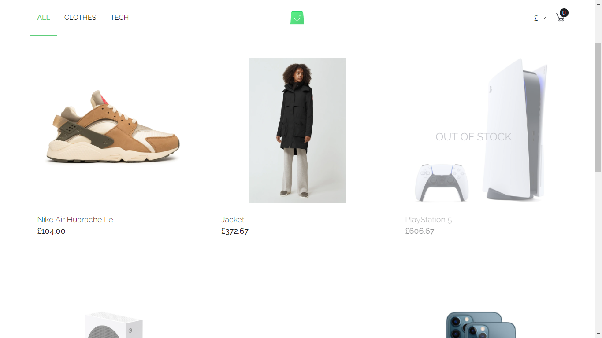
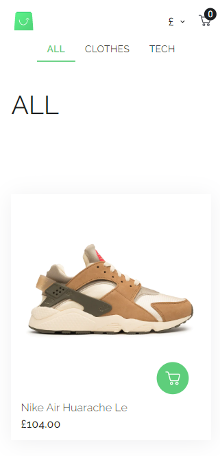

# Scandify
Scandify is an e-commerce web application built using React.

## Technologies & Tools Used
- React.js (Building UI)
- Redux (State Management)
- React Router (Routing )
- Styled Components (Styling)
- React Helmet (SEO)
- React Spring (Animate React Components)
- Lottie React (Animated Loader)

## Features
- User can view a list of products
- User can view a product's details
- User can add/remove products and change their amounts in cart.
- User can select multiple product attributes (options).
- User can view cart in cart page / mini cart.
- User can change the currency of the store to one of the available currencies. 
- Mobile Responsive: compatible to all screens

## Preview

